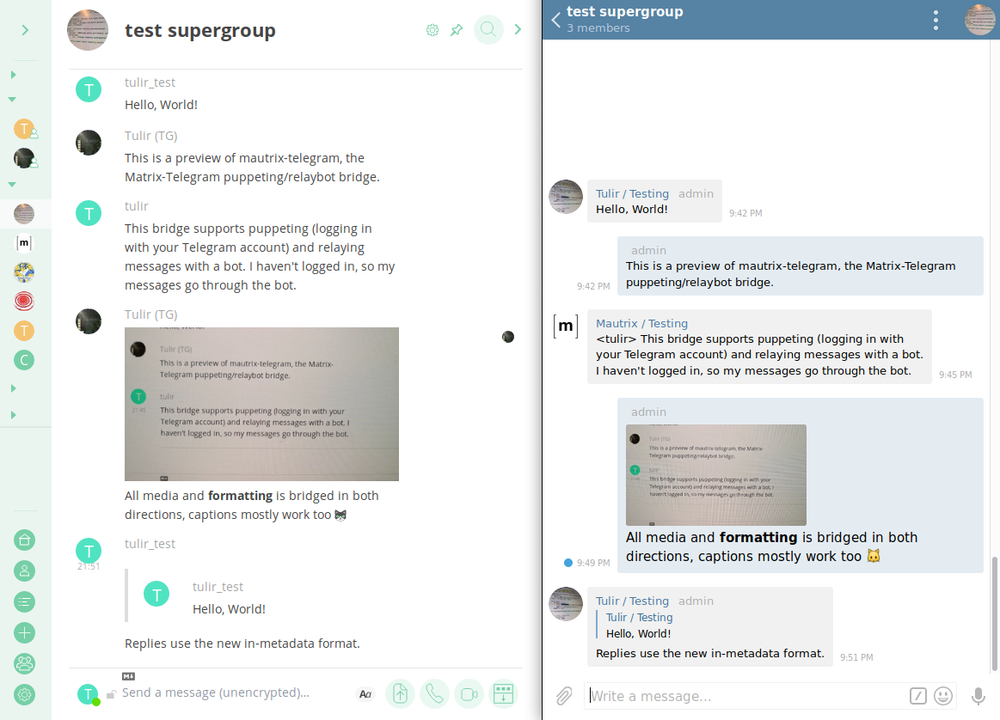

# mautrix-telegram

A Matrix-Telegram hybrid puppeting/relaybot bridge.

## Sponsors
* [Joel Lehtonen / Zouppen](https://github.com/zouppen)

### Wiki
All setup and usage instructions are located in the GitHub
[wiki](https://github.com/tulir/mautrix-telegram/wiki). Some quick links:

* [Bridge setup](https://github.com/tulir/mautrix-telegram/wiki/Bridge-setup)
  (or [with Docker](https://github.com/tulir/mautrix-telegram/wiki/Bridge-setup-with-Docker))
* Basic usage: [Authentication](https://github.com/tulir/mautrix-telegram/wiki/Authentication),
  [Creating chats](https://github.com/tulir/mautrix-telegram/wiki/Creating-and-managing-chats),
  [Relaybot setup](https://github.com/tulir/mautrix-telegram/wiki/Relay-bot)

### Features & Roadmap
[ROADMAP.md](https://github.com/tulir/mautrix-telegram/blob/master/ROADMAP.md)
contains a general overview of what is supported by the bridge.

## Discussion
Matrix room: [`#telegram:maunium.net`](https://matrix.to/#/#telegram:maunium.net)

Telegram chat: [`mautrix_telegram`](https://t.me/mautrix_telegram) (bridged to Matrix room)

## Preview

