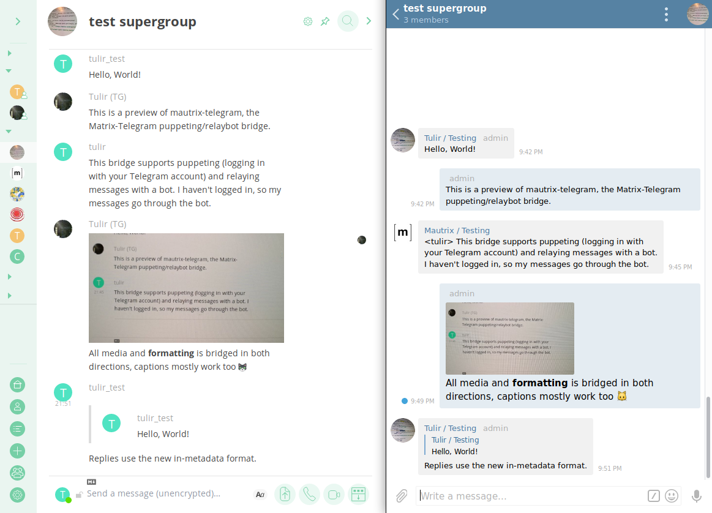

# mautrix-telegram

A Matrix-Telegram puppeting/relaybot bridge.

## Sponsors
* [Joel Lehtonen / Zouppen](https://github.com/zouppen)

## Documentation
All setup and usage instructions are located on
[docs.mau.fi](https://docs.mau.fi/bridges/go/telegram/index.html).
Some quick links:

* [Bridge setup](https://docs.mau.fi/bridges/go/setup.html?bridge=telegram)
  (or [with Docker](https://docs.mau.fi/bridges/general/docker-setup.html?bridge=telegram))
* Basic usage: [Authentication](https://docs.mau.fi/bridges/go/telegram/authentication.html)

### Features & Roadmap
[ROADMAP.md](ROADMAP.md) contains a general overview of what is supported by the bridge.

## Discussion
Matrix room: [`#telegram:maunium.net`](https://matrix.to/#/#telegram:maunium.net)

Telegram chat: [`mautrix_telegram`](https://t.me/mautrix_telegram) (bridged to Matrix room)

## Preview

